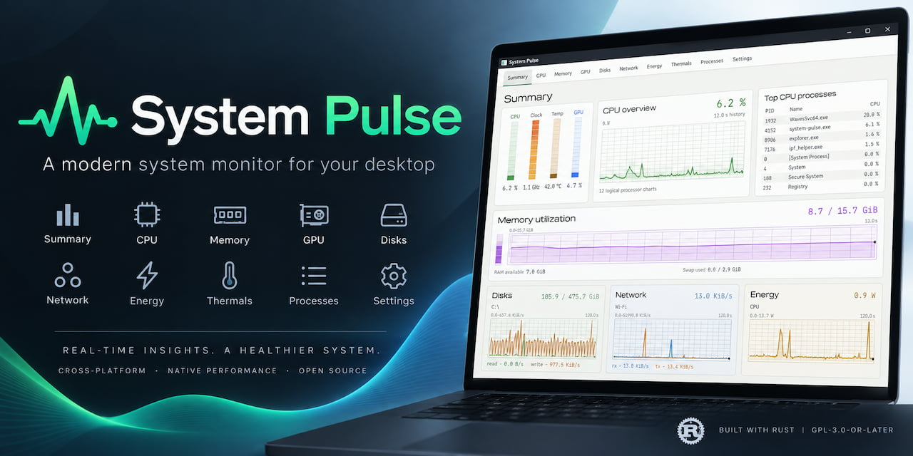
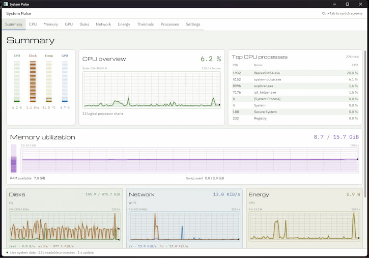
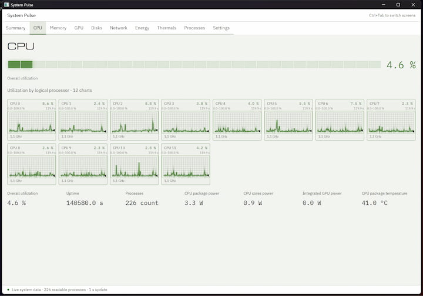
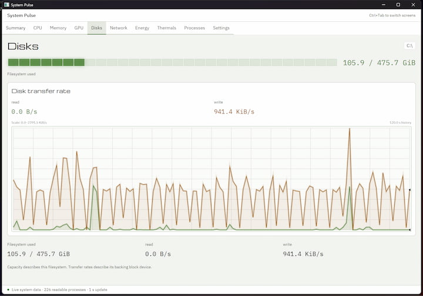
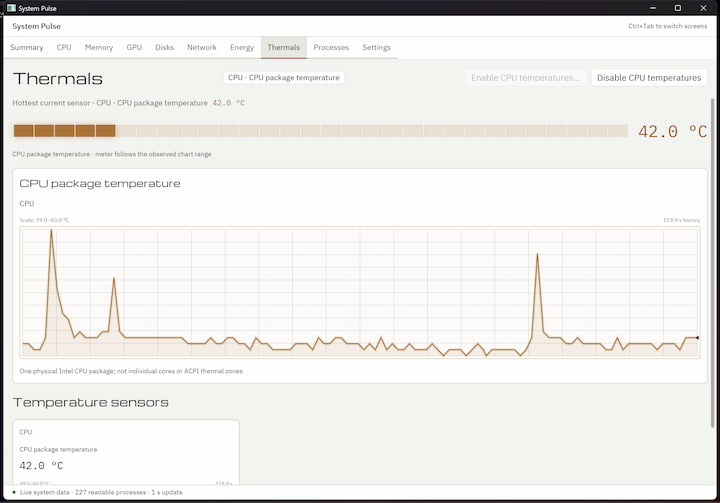
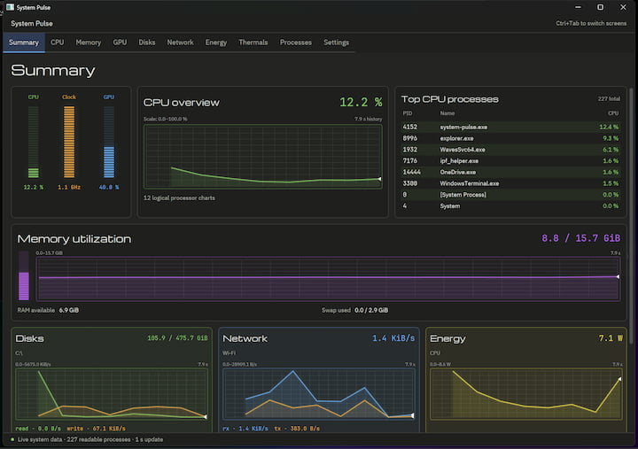
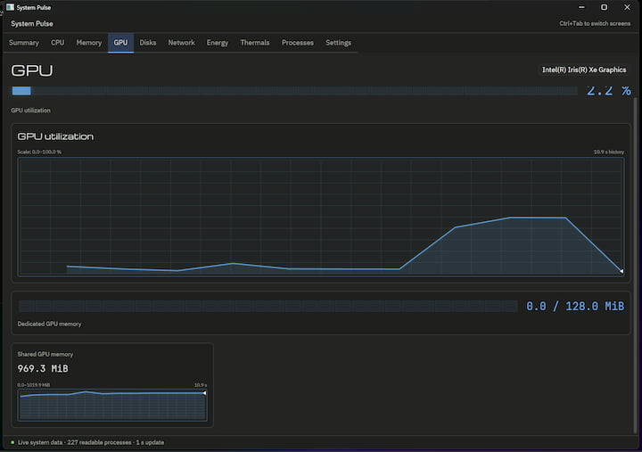
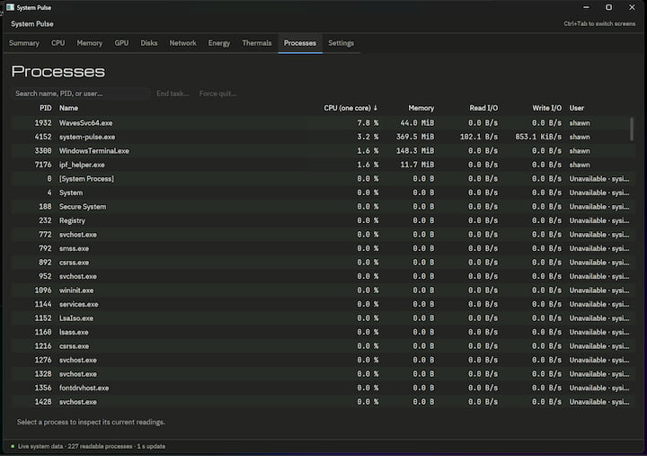
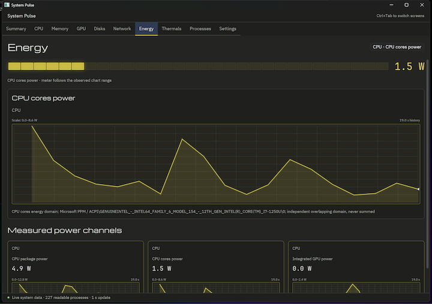

# System Pulse

A native desktop system monitor built with Rust and GPUI Kit 0.6.1. This repository contains the application and the patched base/component libraries it uses; unmodified framework packages are ordinary Cargo dependencies.

System Pulse provides Summary, CPU, Memory, GPU, Disks, Network, Energy, Thermals, Processes and Settings screens in a fixed tab strip. Native charts and segmented meters follow the supplied TMOG references. Device selectors, process search and sorting, confirmed task actions, named presets and dark/light themes use live host data and saved preferences.

A small system tray graph shows combined CPU load. Closing the dashboard keeps monitoring and history running while the tray is available. Click the icon or choose **Open System Pulse** to reopen your saved screen; choose **Quit** from the tray menu to exit. Without a tray host, closing the window exits normally. If the tray host disappears while the dashboard is closed, the window reopens.

On Windows, **End task** requests graceful closure and permits an application to decline; **Force quit** terminates the selected process after warning about unsaved work. An access-denied action can request one UAC-authorized helper while the dashboard keeps its normal privileges. See the [process-action guide](docs/user-guide.md) and [current verification commitment](docs/commitments/windows-uac-process-actions.md) for behavior and evidence requirements.

## Windows monitoring

- **GPU:** discovers Intel, AMD and NVIDIA adapters, including integrated graphics and multiple GPUs. Supported readings include utilization, dedicated GPU memory and shared system memory.
- **Energy:** shows supported power readings in watts with clear labels such as CPU package power, CPU cores power, Memory power and Integrated GPU power. Each reading keeps its own scope.
- **Thermals:** reads CPU package temperature on supported Intel systems with one physical CPU package. Choose **Enable CPU temperatures…** and approve the Windows authorization prompt. The dashboard keeps its normal privileges; **Disable CPU temperatures** stops the helper.
- **Optional PawnIO setup:** the signed Windows installer can install the official PawnIO driver required for CPU temperatures. Existing shared PawnIO installations are preserved, including when System Pulse is removed.

Unavailable sensors are hidden across the monitoring screens, including GPU and Summary, and return when readings recover. Failed, stale and warming-up readings retain their status. See the [user guide](docs/user-guide.md) for controls and hardware requirements.

## Screenshots

| | |
| --- | --- |
|  |  |
|  |  |

| | |
| --- | --- |
|  |  |
|  |  |

## Run

The Windows installer and application are digitally signed. The Apple Silicon macOS `.app` is Developer ID signed, notarized by Apple, and stapled. Signed packages record their signing details in `build.json`.

From this repository root:

```sh
cargo run --locked
```

Install the executable with `cargo install --path . --locked --force`.

Build an optimized executable with `cargo build --release --locked -p system-pulse`. The executable is `target/release/system-pulse`.

Application source is in [src](src/), with separate [model](crates/model/) and [collector](crates/collectors/) crates. [Application documentation](docs/user-guide.md) describes controls, configuration and diagnostics; the [package guide](package/README.md) covers installation and removal.

Linux is the primary verification platform. The [tabbed screen record](docs/execution/tabbed-screens.md) tracks the current redesign and its evidence. The [earlier Linux checkpoint](docs/execution/linux-application-checkpoint.md) applies to its named docked-UI revision. Intel/Apple hardware validation and native Mac GUI review remain separate.

The [CPU tray verification record](docs/execution/cpu-tray.md) covers background monitoring, reopening, host recovery and packaged Linux acceptance.

## Verify

```sh
cargo fmt --all -- --check
cargo test --locked --workspace
cargo clippy --locked -p system-pulse -p system-pulse-collectors -p system-pulse-model --all-targets
python3 -B -m unittest discover -s scripts/system-pulse -p 'test_*.py'
python3 -B scripts/system-pulse/application_acceptance.py
```

The full acceptance command requires the native Linux tools and pinned cargo-about generator described in the [application guide](docs/user-guide.md). It runs against a committed tree and writes evidence outside the checkout. The repository relocation is documented in [the publication record](docs/execution/task-manager-repository-publication.md).

## Project records

Start with the [product specification](docs/feature-spec-dockable-system-monitor.md), [current roadmap](docs/spec/roadmap.md) and [tabbed implementation plan](docs/superpowers/plans/2026-09-07-tabbed-screens.md). Historical records retain their original worktree paths and source commits.

## Licenses

System Pulse is GPL-3.0-or-later; see [COPYING](COPYING) and the application crate manifests. The bundled GPUI framework retains its [Apache license](LICENSE-APACHE). Third-party code, fonts and native adapters retain their own notices and licenses. The package includes dependency notices and corresponding source.

## Attribution

Developed by Shawn in collaboration with Astra (OpenAI Codex), with assistance in implementation, testing and documentation.
